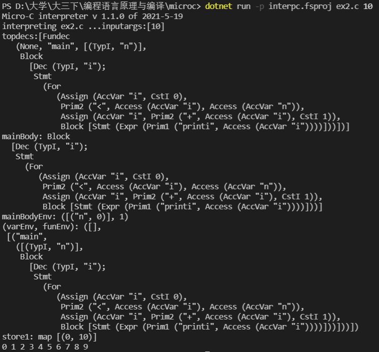

# Microcc
---
- 课程名称：编程语言原理与编译
- 实验项目：期末大作业
- 专业班级：计算机1801
- 学生学号：31801086，31801089
- 学生姓名：应雨杭，林世宇
- 实验指导教师: 郭鸣
---

## 简介
这是一个编译原理大作业，主要基于microC完成的。

本次大作业，我们在解释器中做了大量的尝试，实现了do while，switch case，for循环，i++，i--，注释，三目运算符等等功能，我们按照自己的思路设计词法分析器，语法分析器，以及解释器。

## 结构
- 前端：由`F#`语言编写而成  
  - `Clex.fsl`生成的`Clex.fs`词法分析器。
  - `CPar.fsy`生成的`Cpar.fs`语法分析器。
  - `Absyn.fs` 定义了抽象语法树
  - `interp.fs`解释器
  - `Contcomp.fs`编译器

- 测试集：测试程序为ex1.c——ex7.c

## 用法
- ` dotnet restore  interpc.fsproj `
- ` dotnet clean  interpc.fsproj  `
- ` dotnet build -v n interpc.fsproj  `
构建解释器 

- ` dotnet run -p interpc.fsproj ex1.c 0`
测试do while循环

## 功能实现

### 改进列表：

1. 修改注释表示方式，将注释  /*   */改为(* *)
2. 修改标识符定义，类型名称以大写开头
3. 增加关键字do、for、switch 、case
4. 增加标识符 ++ ：?
5. 增加do while循环和for循环
6. 增加switch case
7. 增加i++和i--
8. 增加三目运算符   表达式?表达式：表达式
9. 增加被除数是0的情况

### 用例说明：

1.ex1.c用到do while和i++

2.ex2.c用到for循环

3.ex3.c用到switch case

4.ex4.c用到do while和i--

5.ex5.c用到注释

6.ex6.c用到三目运算符

7.ex7.c说明被除数是0的情况
  
  
	- ex1.c代码  
   
  
  - 语法树及运行结果 
  

  - ex2.c代码  
   
  
  - 语法树及运行结果 
  

  - ex3.c代码  
   
  
  - 语法树及运行结果 
  

  - ex4.c代码  
   
  
  - 语法树及运行结果 
  

  - ex5.c代码  
   
  
  - 语法树及运行结果 
  

  - ex6.c代码  
   
  
  - 语法树及运行结果 
  

  - ex7.c代码  
   
  
  - 语法树及运行结果 
  
  

 

## 心得体会
- 应雨杭：  
    编译原理这门课很深奥，F#是一个完全没接触过的全新类型的语言，所以一切都得自己慢慢摸索和探索，通过本次编译原理大作业，加深了我对于计算本质的理解与运用。老师上课讲的很好，但是比较难理解，课后需要及时消化，遇到问题，老师也会耐心地解答。这次大作业让我受益匪浅，不仅锻炼了我独立思考的能力，还锻炼了小组内的团结互助，我也对编译原理有了初步的了解，编译原理的世界还是相当有趣的，希望今后我能更加深入地了解编译原理，以及加深对整个计算机上系统的深刻理解，让自己的知识和能力都更上一层楼！
    

- 林世宇：  
    在初学编译原理一个学期后，我们进行了对一种编译语言的学习和改进，尝试实现更多不同的功能。通过编译语言，了解到了程序设计语言编译程序构造的基本原理和设计方法。只有深入地了解了编译原理，才能让我更加了解计算机语言的形成，使我受益匪浅。

    
## 技术评价

| 功能 | 对应文件 | 优  | 良  | 中  |
| ---- | -------- | --- | --- | --- |
|i++，i--|ex1.c ex4.c|√|||
|do-while|ex1.c ex4.c||√||
|for循环|ex2.c|√|||
|switch-case|ex3.c||√||
|注释|ex5.c|√|||
|三目运算符|ex6.c|√|||
|被除数为0|ex7.c|√|||
## 小组分工

- 应雨杭
  - 学号：31801086
  - 班级：计算机1801
    - 工作内容
      - 文档编写
      - 测试程序
      - 语法分析
      - 词法分析
      - do-while、switch-case、三目运算符、被除数为0
- 林世宇
  - 学号：31801089
  - 班级：计算机1801
    - 工作内容
      - 文档编写
      - 测试程序
      - 语法分析
      - 词法分析
      - i++，i--、for循环、注释
  
- 权重分配表：  

| 应雨杭 | 林世宇 |
| ------ | ------ |
| 0.95  | 0.95   |
